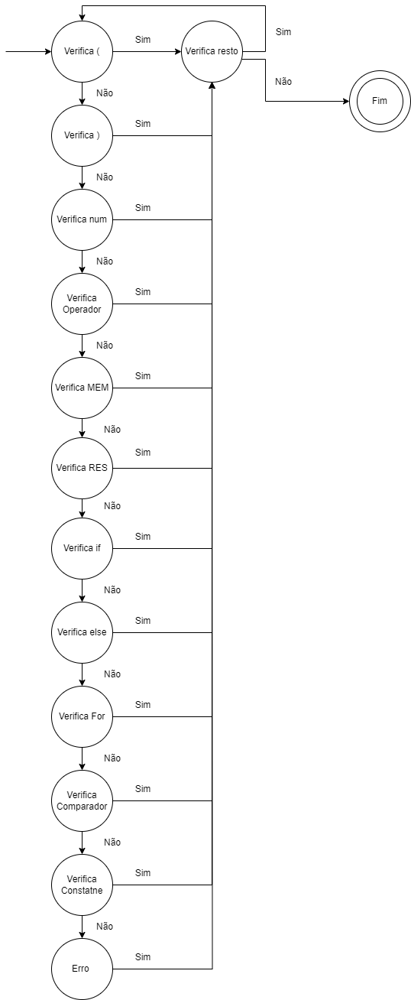
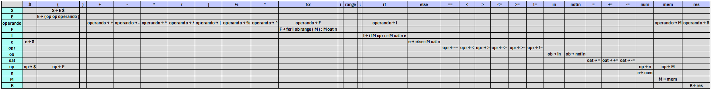

# CALCULATOR PROJECT - PHASE 2
This is a Python program implemented to perform lexical and syntactical validation of the expressions contained in the available test files. To ensure correct syntactical analysis, a finite state machine was created based on a valid pattern of arithmetic and non-arithmetic expressions.

## Program Execution
If the following files are available:  
analisador.py  
formulas1.txt  
formulas2.txt  
formulas3.txt  
MEFAnalisadorLexico.png  
readme.md  
TabelaDerivacao.png  
Run the command: `antlr4 -Dlanguage=Python3 Sintatico.g4`   
Otherwise, just run: 
--- Replit Shell  
`python analisador.py 'formulasn'`  
Where n can be: 1, 2, or 3.  

### Example of a valid expression pattern
(8 16 -)  
(48 (16 1 -) |)  
((5 RES) MEM)  
(MEM 2 *)  
((5.8 4.2 +) (2 3 *) +)  
(4 (2 3 *) +)  
(2 RES)  
(2 (2 (2 (2 (2 2 *) *) *) *) *)  
(if MEM >= 5: MEM = 10)  
(if MEM < 3: MEM = 1 else: MEM = 5)  
(for i in range(MEM): MEM -= 10)  
(2 MEM +)  

Additionally, valid expressions are separated into tokens, which are used to generate a string of tokens.

After performing lexical analysis, the program validates the syntax of expressions that have no lexical errors. For correct analysis, the syntactical analyzer was developed based on the production rules created and the LL(1) table.

Furthermore, the program generates the corresponding syntax tree for the production rules created and validated with FIRST and FOLLOW for LL(1).

## Lexical Analyzer with Finite State Machine
### - Finite State Machine Transition Diagram
 
The finite state machine created for the lexical analyzer uses the valid expression structure mentioned earlier. Its functionality is as follows:

#### State 1:
Checks if the input is an open parenthesis '('.

#### State 2:
Checks if the input is a close parenthesis ')'.

#### State 3:
Checks if the input is a number (int or float).

#### State 4:
Checks if the input is an arithmetic operator ('+', '-', '*', '|', '/', '%', '^').

#### State 5:
Checks if the input is 'MEM'.

#### State 6:
Checks if the input is 'RES'.

#### State 7:
Checks if the input is 'if'.

#### State 8:
Checks if the input is 'else:'.

#### State 9:
Checks if the input is 'for'.

#### State 10:
Checks if the input is a comparison operator ('==', '<', '>', '<=', '>=', '!=' or 'in', 'not in' or '=', '+=', '-=', '*=', '/=', '%=', '^=', '|=').

#### State 11:
Checks if the input is a constant ('i', 'range', ':').

The verification is performed linearly, where the machine checks state 1, and if invalid, moves to state 2. If it reaches state 11 and the expression is still invalid, it transitions to the error state, indicating a lexical error. If a state is validated, the machine moves to the rest state, where it checks if the expression still has something to be analyzed. If the string reaches the end, the machine finishes, but if the expression is nested, the machine returns to the checks again.

## Syntactical Analyzer
### Production Rules

E → (op op operand)  
operand → + OR - OR * OR / OR | OR % OR ^ OR M OR R OR F OR I   
F → for i ob range ( M ) : M oat n    
I → if M opr n : M oat n e   
e → else : M oat n | $   
opr → == OR < OR > OR <= OR >= OR !=   
ob → in OR notIn   
oat → = OR += OR -=    
op → n OR E OR M OR $   
n → num   
M → mem   
R → res   

Meaning of acronyms:   
E: Expression 
oat: Assignment operator 
ob: Search operator 
opr: Relational operator 
num: [0..9]+ OR [0-9]+\.[0-9]+  

### FIRST and FOLLOW Sets
FIRST(S) = {(} 
FIRST(E) = {(} 
FIRST(operand) = {+, -, *, /, |, %, ^, mem, res, for, if} 
FIRST(F) = {for} 
FIRST(I) = {if} 
FIRST(e) = {else, $} 
FIRST(opr) = {==, <, >, <=, >=, !=} 
FIRST(ob) = {in, notin} 
FIRST(oat) = {=, +=, -=} 
FIRST(op) = {(, $, num, mem} 
FIRST(n) = {num} 
FIRST(M) = {mem} 
FIRST(R) = {res} 

FOLLOW(S) = {$} 
FOLLOW(E) = {+, -, *, /, |, %, ^, mem, res, for, if, (, $, num} 
FOLLOW(operand) = {)} 
FOLLOW(F) = {)} 
FOLLOW(I) = {)} 
FOLLOW(e) = {)} 
FOLLOW(opr) = {num} 
FOLLOW(ob) = {range} 
FOLLOW(oat) = {num} 
FOLLOW(op) = {+, -, *, /, |, %, ^, mem, res, for, if, (, $, num} 
FOLLOW(n) = {), else, $, :, +, -, *, /, |, %, ^, mem, res, for, if, (, num} 
FOLLOW(M) = {), =, +=, -=, ==, <, >, <=, >=, !=, +, -, *, /, |, %, ^, mem, res, for, if, (, $, num} 
FOLLOW(R) = {)} 

### Derivation Table
 
After creating the production rules with First and Follow for LL(1) and the derivation table, a syntactical analyzer was developed using ANTLR, which respects the created grammar.

Additionally, treatments were done to fill the empty spaces between parentheses with $, allowing the syntactical analyzer to perform the validation correctly.
